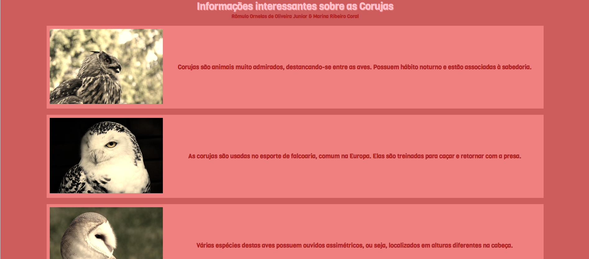
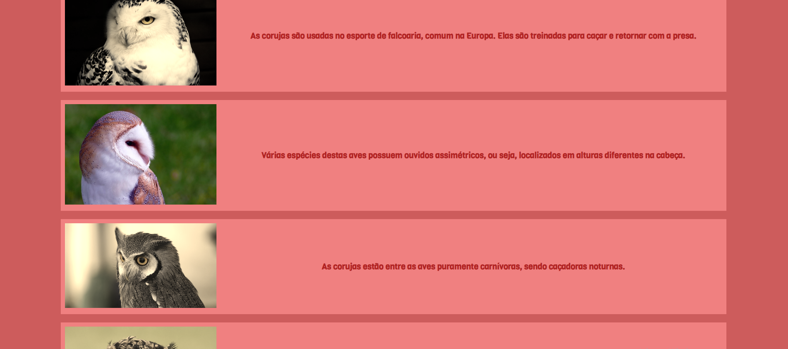

# siteCorujasAulaCSS
site básico para treinar css em aula 
feito em dupla: Marina e eu
  

  <h3>Página com CSS</h3>
  

  

  <h3>Quando passa o mouse em cima, a imagem toma sua cor original</h3>
  

